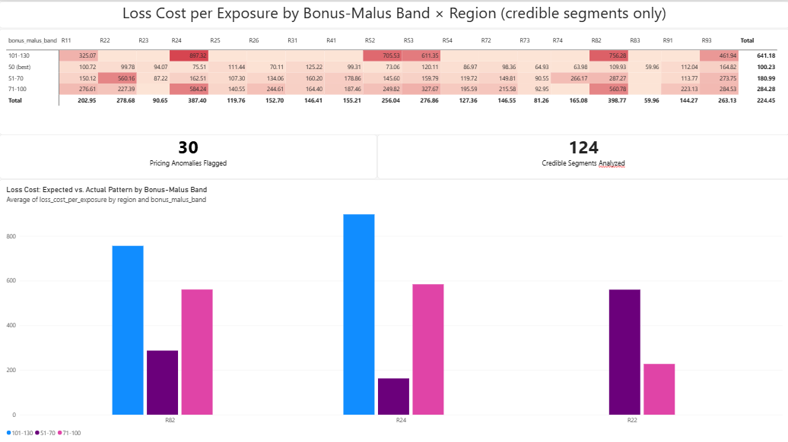
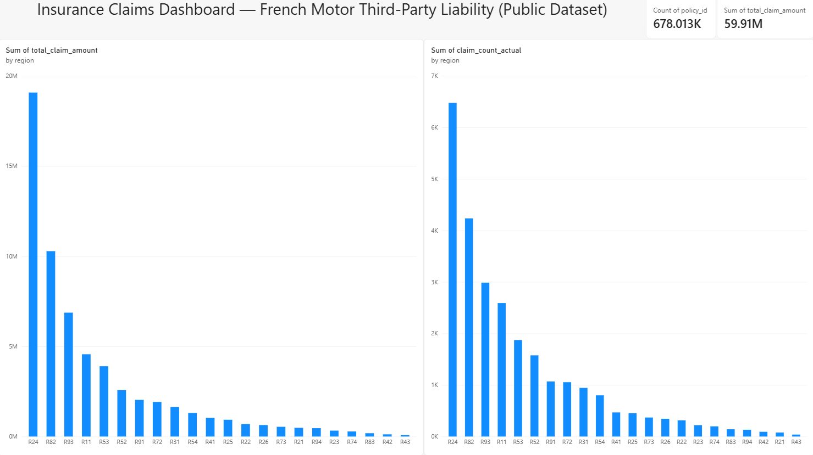

# Insurance Data Engineering Pipeline

Built an end-to-end insurance data pipeline using Python, PostgreSQL and dbt, transforming publicly available French motor third-party liability insurance data into tested, business-facing analytical marts, with a Power BI dashboard on top.

## Overview

This project demonstrates a reproducible, modern data engineering workflow applied to real insurance data: raw files are ingested programmatically, loaded into a PostgreSQL warehouse, modeled through a layered dbt architecture (staging → intermediate → marts), validated with automated data-quality and business-logic tests, and surfaced through a Power BI dashboard answering real business questions.

## Architecture

```text
Public Insurance Data (OpenML / CASdatasets)
        ↓
   Python Ingestion
        ↓
     PostgreSQL
        ↓
        dbt
 ┌──────────────┐
 │   Sources    │
 └──────┬───────┘
        ↓
     Staging
        ↓
   Intermediate
        ↓
      Marts
        ↓
 fct_policy_claims ──→ mart_risk_segment_loss_cost
        ↓                        ↓
  dbt Tests (5 schema       dbt Test (business-logic,
   tests, passing)           warn severity: 30 flagged)
        ↓                        ↓
            Power BI Dashboard
```

## Dataset

**freMTPL2freq** and **freMTPL2sev** — French motor third-party liability insurance data, maintained in the [CASdatasets](https://github.com/dutangc/CASdatasets) project and retrieved programmatically via [OpenML](https://www.openml.org/) (dataset IDs 41214 and 41215).

- `freMTPL2freq`: 678,013 policies — risk characteristics (vehicle power/age, driver age, bonus-malus, region, etc.) and claim counts
- `freMTPL2sev`: 26,639 individual claims — claim amounts, linked to policies via `IDpol`

## Pipeline

1. **Ingestion** (`src/ingestion/download_data.py`) — pulls both datasets programmatically from OpenML; raw data is never committed to the repo, only the script that reproduces it
2. **Loading** (`src/ingestion/load_to_postgres.py`) — loads raw CSVs into PostgreSQL as `raw_fremtpl2freq` and `raw_fremtpl2sev`
3. **Transformation (dbt)**:
   - **Staging** — cleans and renames source columns, casts types (`stg_fremtpl2freq`, `stg_fremtpl2sev`)
   - **Intermediate** — aggregates claim-level data to policy level (`int_policy_claims_agg`)
   - **Marts** — joins policy and claims data into a single analytics-ready fact table (`fct_policy_claims`), then segments it by rating factor into `mart_risk_segment_loss_cost`
4. **Testing**:
   - 5 dbt schema tests (`not_null`, `unique`) on primary keys across staging and mart models, all passing
   - 1 custom business-logic test (`assert_bonus_malus_monotonic`, warn severity) checking whether loss cost rises monotonically with bonus-malus risk band, as the rating factor assumes
5. **Analytics** — Power BI dashboard connected to `fct_policy_claims` and `mart_risk_segment_loss_cost`

## Business Questions Answered

- **Which rating-factor segments show loss cost inconsistent with their risk band?**
  Built a mart (`mart_risk_segment_loss_cost`) combining claim frequency and
  severity into a single loss-cost-per-exposure metric across bonus-malus x
  vehicle power x region. A custom dbt test (warn-severity) checks whether
  loss cost rises monotonically with bonus-malus within each region, as the
  rating factor assumes.

- **Does it hold?** No — 30 segment-pairs break the expected pattern. The
  clearest case: region R22's mid-risk band (51-70) carries a higher loss
  cost (£560/exposure-unit) than the nominally worse band (71-100, £209-246).
  Regions R82 and R24 show similar ~35% breaks at higher bonus-malus tiers.
  These are candidates for re-pricing review.

- **How much of the portfolio sits in segments too small to price reliably?**
  Segments with fewer than 30 claims are flagged `low credibility`. In this
  dataset, 14 of the 15 highest-loss-cost segments fall into that bucket —
  meaning the riskiest-looking segments are mostly statistical noise, not
  signal, which is itself a finding: naive segment-level pricing here would
  overreact to small samples.

Two dashboards are included:

- **`dashboards/insurance_dashboard.pbix`** — the original descriptive view (claim cost and frequency by region)
- **`dashboards/risk_segmentation_dashboard.pbix`** — the risk-segmentation analysis above: a heatmapped loss-cost matrix by bonus-malus band x region, KPI tiles for anomaly count and credible-segment count, and a comparison chart for the three regions where the rating factor breaks down



<details>
<summary>Original dashboard (claim cost/frequency by region)</summary>



</details>

## Tech Stack

Python · pandas · SQLAlchemy · PostgreSQL · dbt · Power BI · Git/GitHub

## Project Status

- [x] **MVP1** — Data acquisition, PostgreSQL warehouse
- [x] **MVP2** — dbt staging/intermediate/marts, 5 passing tests
- [x] **MVP3** — Power BI dashboard on business metrics
- [x] **MVP4** — Risk-segment loss-cost analysis with a business-logic test flagging rating-factor anomalies

## Data Limitations

This project uses publicly available historical French motor third-party liability insurance data — it does not contain any Deloitte, client, or policyholder data, and is not representative of any real insurer's production scale, data volume, or latency requirements. The dbt layer uses `not_null`/`unique` schema tests plus one business-logic test appropriate to the dataset's scope; a production pipeline at enterprise scale would require additional tests (referential integrity across source systems, freshness checks, anomaly detection) and orchestration (e.g. Airflow) not yet implemented here.

## Why This Project

I have 4.5 years of enterprise insurance data experience from Deloitte, working with SAP HANA/CDS data models and IFRS17 reporting pipelines. For this portfolio project, I wanted to demonstrate how I'd apply modern data engineering practices — Python, PostgreSQL, dbt, automated testing, and a genuinely harder analytical question (loss-cost adequacy by rating segment, not just claim counts) — to a public insurance dataset, building the kind of layered, tested pipeline I'd bring to a Data Engineer or Analytics Engineer role.

## Reproducing This Project

```bash
git clone https://github.com/neha-nataraja/insurance-de-pipeline.git
cd insurance-de-pipeline
python -m venv .venv
.venv\Scripts\activate
pip install -r requirements.txt
python src/ingestion/download_data.py
# create a .env file with your own PostgreSQL credentials (see .env format below)
python src/ingestion/load_to_postgres.py
cd insurance_dbt
dbt run
dbt test
```

`.env` format:
```
DB_HOST=localhost
DB_PORT=5432
DB_NAME=insurance_pipeline
DB_USER=postgres
DB_PASSWORD=your_password
```